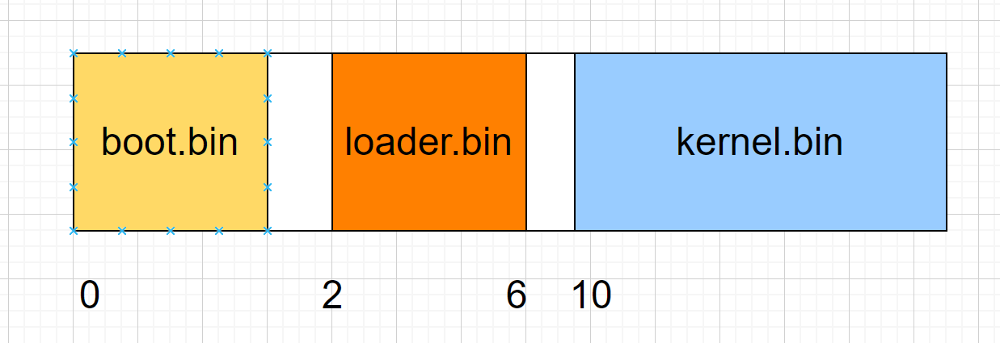

## boot
boot.bin是被BIOS加载的第一个模块，也是第一个接过计算机权柄的模块。在BetaOS的设计了，整个映像文件由三部分组成：

此时实模式下的内存分布为
| 起始地址  | 结束地址  | 大小     | 用途               |
| --------- | --------- | -------- | ------------------ |
| `0x000`   | `0x3FF`   | 1KB      | 中断向量表         |
| `0x400`   | `0x4FF`   | 256B     | BIOS 数据区        |
| `0x500`   | `0x7BFF`  | 29.75 KB | 可用区域           |
| `0x7C00`  | `0x7DFF`  | 512B     | MBR 加载区域       |
| `0x7E00`  | `0x9FBFF` | 607.6KB  | 可用区域           |
| `0x9FC00` | `0x9FFFF` | 1KB      | 扩展 BIOS 数据区   |
| `0xA0000` | `0xAFFFF` | 64KB     | 用于彩色显示适配器 |
| `0xB0000` | `0xB7FFF` | 32KB     | 用于黑白显示适配器 |
| `0xB8000` | `0xBFFFF` | 32KB     | 用于文本显示适配器 |
| `0xC0000` | `0xC7FFF` | 32KB     | 显示适配器 BIOS    |
| `0xC8000` | `0xEFFFF` | 160KB    | 映射内存           |
| `0xF0000` | `0xFFFEF` | 64KB-16B | 系统 BIOS          |
| `0xFFFF0` | `0xFFFFF` | 16B      | 系统 BIOS 入口地址 |

### boot.bin源码分析
boot.bin由boot.S和read_disk.S编译链接而成，其中boot.S负责初始化系统环境，加载loader.bin。read_disk.S负责从硬盘中读取数据。

#### 打开A20地址线
在实模式下，段地址 << 4 + 段内偏移的寻址模式是有可能超过1M的，所以A20地址线总是被设置为0的状态，相当于地址回环。
```asm
.set PROT_MODE_CSEG,    0x8
.set PROT_MODE_DSEG,    0x10
.set CR0_PE_ON,         0x1
.set SMAP,                  0x534d4150

.globl start
start:
.code16
    cli
    cld

    # 初始化段寄存器
    xorw %ax, %ax
    movw %ax, %ds
    movw %ax, %es
    movw %ax, %ss
    movw $0x7C00, %sp

# 开启 A20 地址线
seta20:
    inb $0x92, %al
    orb $0b10, %al
    outb %al, $0x92
```
探测可用内存，通过BIOS 15中断服务
```asm
# 探测内存
probe_memory:
    movl $0, 0x8000
    xorl %ebx, %ebx
    # 设置接受缓冲区
    movw $0x8004, %di
start_probe:
    movl $0xE820, %eax
    # 设置内存结构体的大小
    movl $20, %ecx
    movl $SMAP, %edx
    int $0x15
    jnc cont
    # 出错了
    movw $12345, 0x8000
    jmp finish_probe
cont:
    addw $20, %di
    incl 0x8000
    cmpl $0, %ebx
    jnz start_probe
```
#### 加载全局描述符表
加载全局描述符表，全局描述符定义了段的起始地址、段长度、访问权限等。设置cr0寄存器为1，即可进入保护模式
```asm
finish_probe:
    # 加载全局描述符表 开启保护模式
    lgdt gdtdesc
    movl %cr0, %eax
    orl $CR0_PE_ON, %eax
    movl %eax, %cr0

    ljmp $PROT_MODE_CSEG, $protcseg
```
其中，描述符被定义为
```asm
.data
.p2align 2                                          # force 4 byte alignment
gdt:
    SEG_NULLASM                                     # null seg
    SEG_ASM(STA_X|STA_R, 0x0, 0xffffffff)           # code seg for bootloader and kernel
    SEG_ASM(STA_W, 0x0, 0xffffffff)                 # data seg for bootloader and kernel

gdtdesc:
    .word 0x17                                      # sizeof(gdt) - 1
    .long gdt 
```
#### 进入保护模式，加载loader.bin
进入保护模式后，就不能再使用BIOS的服务了，因为寻址的方式不一样了。所以准备工作要在实模式下做。此时就需要加载loader.bin程序了。
```asm
.code32
protcseg:
    movw $PROT_MODE_DSEG, %ax
    movw %ax, %ds                                   # -> DS: Data Segment
    movw %ax, %es                                   # -> ES: Extra Segment
    movw %ax, %fs                                   # -> FS
    movw %ax, %gs                                   # -> GS
    movw %ax, %ss 
    # 读入Loader
    movl $0x1000, %edi                              # 起始地址
    movl $0x2, %ecx                                 # 起始扇区
    movl $0x4, %ebx                                 # 扇区个数
    call read_sections
    # xchg %bx, %bx
    # 将控制权交给Loader
    movl $0x1000, %esp
    jmp $PROT_MODE_CSEG, $0x1000
```
至此boot的使命完成。