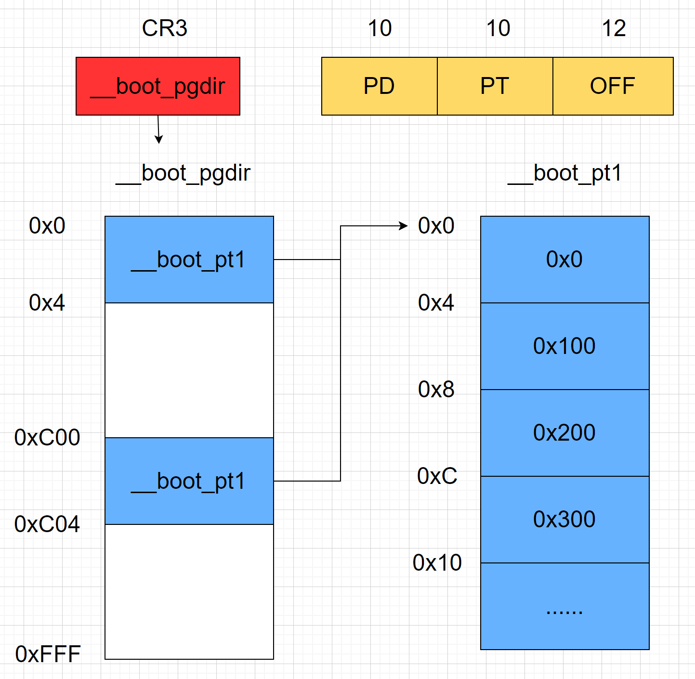
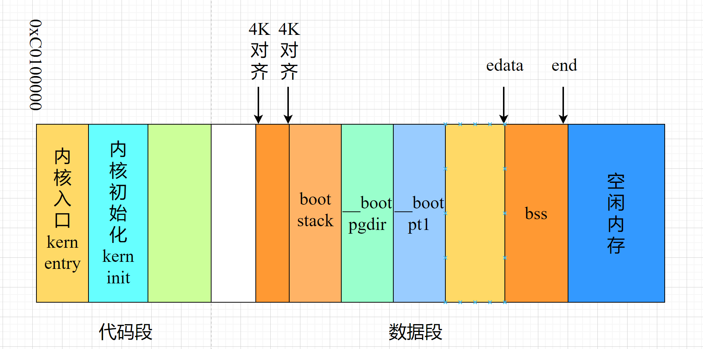

## 环境初始化
执行流从loader转移到kernel后，在建立计算机之前，还需要做一些事情。还记得loader是怎么加载kernel的吗？它读取了ELF格式的kernel，将kernen中的各个段加载到相应的内存位置。但不要忽略了一点，kernel在链接时指定的内存是从0xC0100000开始的，而qemu模拟不了那么多的内存，所以loader在加载时做了与运算，从0x100000处开始，所以此时CPU寻址地址与真实的物理地址就不一致了。内核环境初始化正是为了完成这一步映射。

### 加载页表，开启分页模式
内存映射是通过页表完成，页表可以理解为C++中的map数据结构，key是虚拟地址，value是物理地址。
```asm
# src/kernel/init/entry.S

#include <BetaOS/memlayout.h>
#include <BetaOS/mmu.h>
#define REALLOC(x) (x - KERNBASE)
.text
.globl kern_entry
kern_entry:
    # load pa of boot pgdir
    movl $REALLOC(__boot_pgdir), %eax
    movl %eax, %cr3

    # enable paging
    movl %cr0, %eax
    orl $(CR0_PE | CR0_PG | CR0_AM | CR0_WP | CR0_NE | CR0_TS | CR0_EM | CR0_MP), %eax
    andl $~(CR0_TS | CR0_EM), %eax
    movl %eax, %cr0

    # update eip
    # now, eip = 0x1.....
    leal next, %eax
    # set eip = KERNBASE + 0x1.....
    jmp *%eax
```
页表被定义为
```asm
# src/kernel/init/entry.S

# kernel builtin pgdir
# an initial page directory (Page Directory Table, PDT)
# These page directory table and page table can be reused!
.section .data.pgdir
.align PGSIZE
__boot_pgdir:
.globl __boot_pgdir
    # map va 0 ~ 4M to pa 0 ~ 4M (temporary)
    .long REALLOC(__boot_pt1) + (PTE_P | PTE_U | PTE_W)
    .space (KERNBASE >> PGSHIFT >> 10 << 2) - (. - __boot_pgdir) # pad to PDE of KERNBASE
    # map va KERNBASE + (0 ~ 4M) to pa 0 ~ 4M
    .long REALLOC(__boot_pt1) + (PTE_P | PTE_U | PTE_W)
    .space PGSIZE - (. - __boot_pgdir) # pad to PGSIZE

.set i, 0
__boot_pt1:
.rept 1024
    .long i * PGSIZE + (PTE_P | PTE_W)
    .set i, i + 1
.endr
```
是不是有点晕，没关系。我们来画个图就明白了。


上面的汇编语言建立了一个初级的页表映射机制。开启分页模式后，cpu发出的寻址指令被分为三个部分，分别是页目录索引PD，页表索引PT和页内偏移OFF。每一页的大小为4KB，即0x100，页表中的每一项称为页表项，大小为4B，每个页表可以看成是大小为1K的页表项数组。CR3寄存器存储的是页目录的页表地址。

以虚拟地址`addr = 0xC03FFFFF`，即`KERNBASE + 4M - 1`为例。首先它的页目录索引为`PD = addr >> 22 = 0x300`，以`PD`为索引访问`__boot_pgdir`，刚好可以得到地址为`0xC00`的页表项`(0x300 * 4 = 0xC00)`，其内容为`__boot_pt1`。

接下来计算addr的页表索引`PT = (addr >> 12) & 0x3FF = 0x3FF`，再以`PT`为索引访问`__boot_pt1`，得到地址为`0xFFC`的页表项，其内容为`0x3FF000`。

最后，`addr`的业内偏移为`0xFFF`，加上上一步页表项的`0x3FF000`，就是`0x3FFFFF`，即`4M - 1`的内存地址。

所以，上图中的页表建立的映射关系就是把`0~4M`和`KERNBASE~KERNBASE+4M`的虚拟内存地址映射到`0~4M`的物理地址。为什么是4M呢？因为BetaOS的内核很小，一般不会超过4M，所以只映射4M也够用了。

### 进入内核主函数
完成了映射之后，接下来就是刷新eip，进入内核了。
```asm
# src/kernel/init/entry.S

next:

    # unmap va 0 ~ 4M, it's temporary mapping
    xorl %eax, %eax
    movl %eax, __boot_pgdir

    # set ebp, esp
    movl $0x0, %ebp
    # the kernel stack region is from bootstack -- bootstacktop,
    # the kernel stack size is KSTACKSIZE (8KB)defined in memlayout.h
    movl $bootstacktop, %esp
    # now kernel stack is ready , call the first C function
    call kern_init

# should never get here
spin:
    jmp spin
```
这里可以思考一下，为什么跳转之后第一件事是取消0~4M虚拟内存的映射？而之前为什么一定要设置呢？其中的关键就是`eip`寄存器。在没有遇到`jmp``call`之类的跳转指令前，`eip`是顺序递增的，所以在加载完`CR3`寄存器，开启分页模式后，eip的值是在虚拟地址`0~4M`以内的。若是不设置此内存空间的临时映射，cpu取指时会发生错误。

而当跳转到`next`之后，`next`的虚拟内存地址是在`0xC0100000`之上的，此时就可以取消`0~4M`虚拟地址空间的临时映射了，将这段内存空间返还给用户态。然后就是设置栈帧指针，调用内核主函数`kern_init`了。内核栈空间的定义如下：
```asm
.data
.align PGSIZE
    .globl bootstack
bootstack:
    .space KSTACKSIZE
    .globl bootstacktop
bootstacktop:
```
经过引导、加载和环境初始化，我们终于打开了内核的大门，进入了真正的内核世界。

### 内核文件结构
内核的链接脚本为
```shell
# src/tools/kernel.ld

OUTPUT_FORMAT("elf32-i386", "elf32-i386", "elf32-i386")
OUTPUT_ARCH(i386)
ENTRY(kern_entry)

SECTIONS {
    /* Load the kernel at this address: "." means the current address */
    . = 0xC0100000;

    .text : {
        *(.text .stub .text.* .gnu.linkonce.t.*)
    }

    PROVIDE(etext = .); /* Define the 'etext' symbol to this value */

    .rodata : {
        *(.rodata .rodata.* .gnu.linkonce.r.*)
    }

    /* Include debugging information in kernel memory */
    .stab : {
        PROVIDE(__STAB_BEGIN__ = .);
        *(.stab);
        PROVIDE(__STAB_END__ = .);
        BYTE(0)     /* Force the linker to allocate space
                   for this section */
    }

    .stabstr : {
        PROVIDE(__STABSTR_BEGIN__ = .);
        *(.stabstr);
        PROVIDE(__STABSTR_END__ = .);
        BYTE(0)     /* Force the linker to allocate space
                   for this section */
    }

    /* Adjust the address for the data segment to the next page */
    . = ALIGN(0x1000);

    /* The data segment */
    .data : {
        *(.data)
    }

    PROVIDE(edata = .);

    .bss : {
        *(.bss)
    }

    PROVIDE(end = .);

    /DISCARD/ : {
        *(.eh_frame .note.GNU-stack)
    }
}
```
根据此脚本链接得到的内核文件结构为
